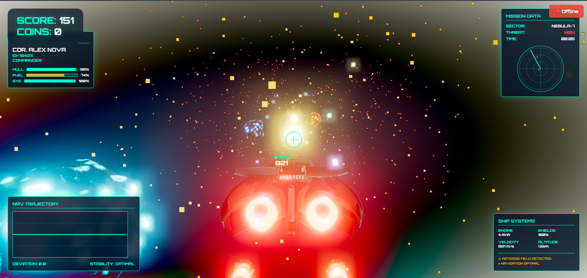

# 🚀 Nebula Runner

A high-performance 3D space runner game built with Three.js, featuring real-time leaderboards and cross-platform optimization.

## 🌟 Live Demo

- **Frontend**: [https://nebula-runner.vercel.app](https://nebula-runner.vercel.app)
- **Backend API**: [https://nebula-runner-backend.onrender.com/api/health](https://nebula-runner-backend.onrender.com/api/health)

## 🎮 Game Features

- **Immersive 3D Graphics**: Built with Three.js and WebGL, and optimized for smooth gameplay
- **Real-time Leaderboards**: Global and personal score tracking with live updates
- **Cross-Platform Optimization**: Fully Responsive design for desktop and mobile devices
- **Advanced Visual Effects**: Custom shaders, particle systems, and post-processing
- **Offline Support**: Local score caching with automatic synchronization
- **Progressive Loading**: Custom cool, sci-fi themed loading screen with real-time progress

## How to Run/Play

-Play with arrow keys or A/D
-Collect Coins(YELLOW)
-Avoid the Asteroids or you'll explode

## 🛠️ Technology Stack

### Frontend
- **Three.js** - 3D graphics and WebGL rendering
- **Vanilla JavaScript** - Core game logic and DOM manipulation
- **CSS3** - Responsive UI and animations
- **HTML5** - Semantic structure and Canvas API

### Backend
- **Node.js** - Server runtime environment
- **Express.js** - RESTful API framework
- **MongoDB** - NoSQL database for score persistence
- **Mongoose** - Object Document Mapping (ODM)

### Deployment & DevOps
- **Vercel** - Frontend hosting and CI/CD
- **Render** - Backend hosting and auto-deployment
- **MongoDB Atlas** - Cloud database hosting
- **GitHub** - Version control and automated deployments

## 📱 Performance Optimizations

### Mobile-First Design
- **Adaptive Quality Settings**: Automatic graphics quality adjustment based on device capabilities
- **Touch Controls**: Swipe-based navigation optimized for mobile gameplay
- **Responsive UI**: Dynamic layout adjustments for different screen sizes
- **Asset Optimization**: Compressed textures and reduced polygon counts for mobile devices

### Technical Optimizations
- **Frame Rate Management**: Consistent 60fps across devices through adaptive rendering
- **Memory Management**: Efficient asset loading and garbage collection
- **Network Optimization**: Offline-first architecture with background synchronization
- **Bundle Optimization**: Minimized asset sizes and lazy loading implementations

## 🏆 Key Technical Achievements

### Advanced Graphics Programming
- Custom shader implementations for visual effects
- Real-time particle systems for explosions and space debris
- Post-processing pipeline with bloom and depth-of-field effects
- Dynamic lighting and shadow systems

### Full-Stack Architecture
- RESTful API design with proper error handling
- Database schema optimization for leaderboard queries
- Cross-origin resource sharing (CORS) configuration
- Environment-specific configuration management

### DevOps & Deployment
- Continuous integration/deployment pipeline
- Environment variable management
- Production-ready error handling and logging
- Scalable hosting architecture

## 🎨 Design Philosophy

### User Experience
- **Intuitive Controls**: Simple yet responsive gameplay mechanics
- **Visual Feedback**: Clear indicators for user actions and game state
- **Progressive Disclosure**: Gradual introduction of game complexity
- **Accessibility**: Support for various input methods and screen sizes

### Technical Excellence
- **Clean Code**: Modular architecture with separation of concerns
- **Performance First**: Optimized for smooth gameplay across devices
- **Scalable Design**: Architecture supports future feature additions
- **Best Practices**: Industry-standard development and deployment practices

## 🚀 Future Enhancements

### Planned Features
- [ ] Multiplayer functionality with real-time competition
- [ ] Power-up system with special abilities
- [ ] Achievement system and player progression
- [ ] Level editor for user-generated content
- [ ] Social features and friend leaderboards

### Technical Roadmap
- [ ] WebGPU integration for enhanced graphics performance
- [ ] Progressive Web App (PWA) support for offline gameplay
- [ ] Advanced AI opponents with machine learning
- [ ] Analytics dashboard for gameplay insights
- [ ] AI features

## 🤝 Contributing

1. Fork the repository
2. Create a feature branch (`git checkout -b feature/amazing-feature`)
3. Commit your changes (`git commit -m 'Add amazing feature'`)
4. Push to the branch (`git push origin feature/amazing-feature`)
5. Open a Pull Request

## 👨‍💻 Developer

**Hari Om Sharma**  
Indian Institute of Technology, Roorkee (India)

- GitHub: [@hariom57](https://github.com/hariom57)
- Instagram: [@hariom_sharma_005](https://instagram.com/hariom_sharma_005)
- LinkedIn: [@hari-om-sharma](https://linkedin.com/in/hari-om-sharma)